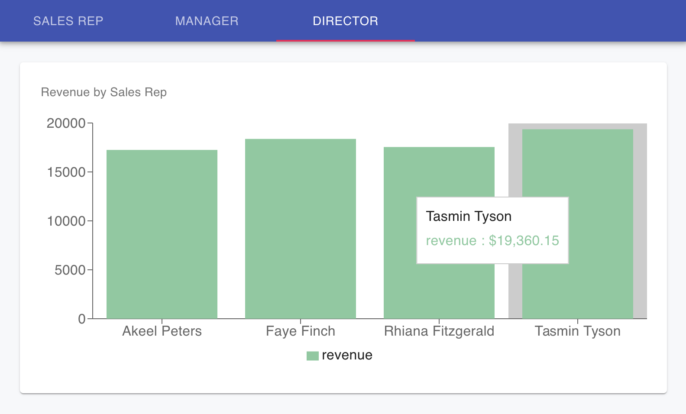

## Task

A new dashboard card feature showing revenue by sales rep. Users can be sales reps, managers, or directors and the card displays a breakdown for each user based on the sales attributed to all sales reps under them.

Simplifications:
- each tab in the app is hard coded in `frontend/src/App.jsx` to request a specific user, that's whose "dashboard" is being displayed
- the backend endpoint doesn't take a date
- there is no authentication

## Getting Started
The app is dockerized so you can reference the `Dockerfile`s and `docker-compose.yml` for any configuration questions (or just run the app with `docker-compose up --build`).

## Example

